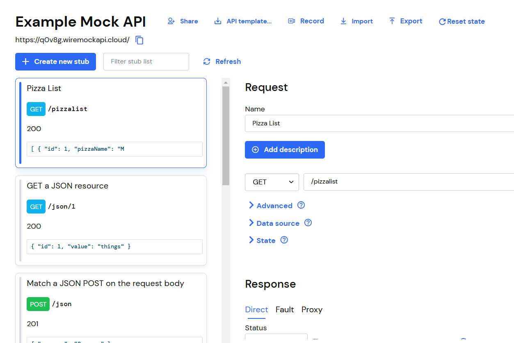
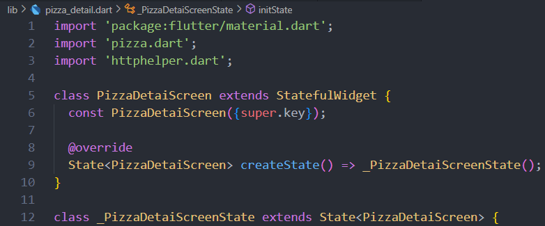

# Jobsheet 15_Flutter - Restful API

**Nama : Ahmad Faza Alfan Fashlah
Kelas : 3C - 02
NIM : 2241720186  **

## PRAKTIKUM 1

### Praktikum 1
1. Mendaftarlah ke layanan Lab Mock di https://app.wiremock cloud/. Bisa anda gunakan akun google untuk mendaftar. Jika berhasil bendaftar dan login, akan muncul seperti gambar berikut.
 
2. Di halaman dahsboard, klik menu Stubs, kemudian klik entri pertama yaitu “GET a JSON
resource”. Anda akan melihat layar yang mirip dengan berikut.
 
3. Klik “Create new stub”. Di kolom sebelah kanan, lengkapi data berikut. Namanya adalah “Pizza List”, kemudian pilih GET dan isi dengan “/pizzalist”. Kemudian, pada bagian Response, untuk status 200, kemudian pada Body pilih JSON sebagai formatnya dan isi konten JSON dari https://bit.ly/pizzalist. Perhatikan gambar berikut.
 
4. Tekan tombol SAVE di bagian bawah halaman untuk menyimpan Mock ini. Jika berhasil tersimpan, maka Mock API sudah siap digunakan
 
5. Buatlah project flutter baru dengan nama pizza_api_nama_anda, tambahkan depedensi “http” melalui terminal.
 
6. DI folder “lib” project anda, tambahkan file dengan nama “httphelper.dart”
 
7. Isi httphelper.dart dengan kode berikut. Ubah “02z2g.mocklab.io” dengan URL Mock API anda.
 
8. Di file “main.dart”, di class _ MyHomePageState, tambahkan metode bernama “callPizzas”. Metode ini mengembalikan sebuah Future dari daftar objek Pizza dengan memanggil metode getPizzaList dari kelas HttpHelper, dengan kode sebagai berikut:
 
9.  Pada metode build di class _MyHomePageState, di dalam body Scaffold, tambahkan FutureBuilder yang membuat ListView dari widget ListTile yang berisi objek Pizza:
 
10. Jalankan aplikasi. Anda akan melihat layar yang mirip dengan berikut ini:
 

### Praktikum 2
1. Masuk ke layanan Lab Mock di https://app.wiremock.cloud/ dan klik bagian Stubs, kemudian, buatlah stub baru.
2. Lengkapi isian seperti gambar berikut:
 
3. Simpan
4. Di proyek Flutter, di file httpHelper.dart, di kelas HttpHelper, buat metode baru bernama postPizza, lengkapi kode sebagai berikut
 
5. Di dalam proyek, buat sebuah file baru bernama pizza_detail.dart.
 
6. Di bagian atas file baru, tambahkan impor yang diperlukan.
 
7. Buat StatefulWidget bernama PizzaDetailScreen
 
8. Di bagian atas kelas _PizzaDetailScreenState, tambahkan lima widget TextEditingController. Widget ini akan berisi data untuk objek Pizza yang akan diposting nanti. Juga, tambahkan sebuah String yang akan berisi hasil dari permintaan POST.
 
9.  Override metode dispose() untuk membuang controllers
 
10. Dalam metode build() pada kelas, kita return sebuah Scaffold, yang AppBar-nya berisi Teks yang menyatakan “Detail Pizza” dan Body-nya berisi Padding dan SingleChildScrollView yang berisi Column.
 
11. Untuk properti anak dari Column, tambahkan beberapa Text yang akan berisi hasil posting, lima TextFields, masing-masing terikat pada TextEditingController, dan sebuah ElevatedButton untuk menyelesaikan aksi POST (metode postPizza akan dibuat berikutnya). Juga, tambahkan SizedBox untuk memberi jarak pada widget di layar.
 
12. Di bagian bawah kelas _PizzaDetailState, tambahkan metode postPizza
 
13. Di file main.dart, impor file pizza_detail.dart
 
14. Di perancah metode build() dari kelas _MyHomePageState, tambahkan FloatingActionButton yang akan menavigasi ke rute PizzaDetail.
 
15. Jalankan aplikasi. Pada layar utama, tekan FloatingActionButton untuk menavigasi ke rute PizzaDetail
16. Tambahkan detail pizza di kolom teks dan tekan tombol Kirim Postingan. Anda akan melihat hasil yang berhasil, seperti yang ditunjukkan pada gambar berikut.
    
