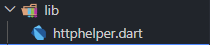

# Jobsheet 15_Flutter - Restful API

**Nama : Ahmad Faza Alfan Fashlah
Kelas : 3C - 02
NIM : 2241720186  **

## PRAKTIKUM 1

### Praktikum 1
1. Mendaftarlah ke layanan Lab Mock di https://app.wiremock cloud/. Bisa anda gunakan akun google untuk mendaftar. Jika berhasil bendaftar dan login, akan muncul seperti gambar berikut.
 
2. Di halaman dahsboard, klik menu Stubs, kemudian klik entri pertama yaitu “GET a JSON
resource”. Anda akan melihat layar yang mirip dengan berikut.
 
3. Klik “Create new stub”. Di kolom sebelah kanan, lengkapi data berikut. Namanya adalah “Pizza List”, kemudian pilih GET dan isi dengan “/pizzalist”. Kemudian, pada bagian Response, untuk status 200, kemudian pada Body pilih JSON sebagai formatnya dan isi konten JSON dari https://bit.ly/pizzalist. Perhatikan gambar berikut.
 
4. Tekan tombol SAVE di bagian bawah halaman untuk menyimpan Mock ini. Jika berhasil tersimpan, maka Mock API sudah siap digunakan
 
5. Buatlah project flutter baru dengan nama pizza_api_nama_anda, tambahkan depedensi “http” melalui terminal.
 
6. DI folder “lib” project anda, tambahkan file dengan nama “httphelper.dart”
 
7. Isi httphelper.dart dengan kode berikut. Ubah “02z2g.mocklab.io” dengan URL Mock API anda.
 
8. Di file “main.dart”, di class _ MyHomePageState, tambahkan metode bernama “callPizzas”. Metode ini mengembalikan sebuah Future dari daftar objek Pizza dengan memanggil metode getPizzaList dari kelas HttpHelper, dengan kode sebagai berikut:
 
9.  Pada metode build di class _MyHomePageState, di dalam body Scaffold, tambahkan FutureBuilder yang membuat ListView dari widget ListTile yang berisi objek Pizza:
 
10. Jalankan aplikasi. Anda akan melihat layar yang mirip dengan berikut ini:
 
